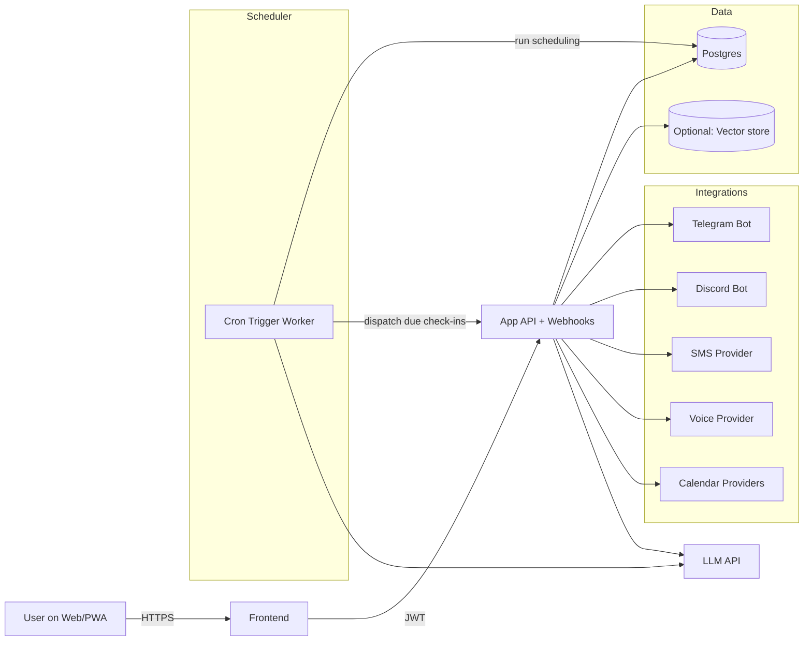
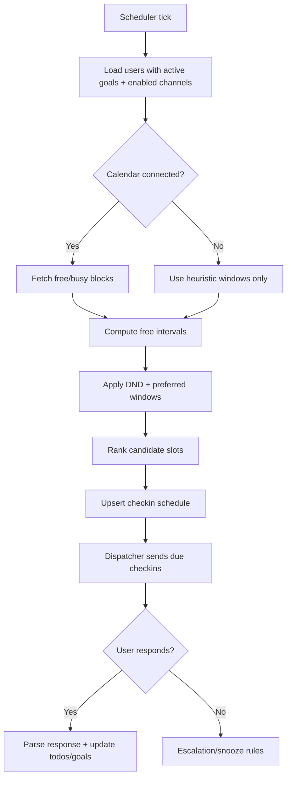

# PRD for a Lightweight Todo App with an AI Check‑In Coach

## Executive summary

This Product Requirements Document defines an MVP todo list app (responsive web + optional PWA install) that adds an AI “coach” which checks in on goals via messaging or phone calls during a user’s likely free time windows. The design prioritizes low operational overhead and free/low‑cost hosting, while keeping integrations modular so you can start with “messages only” and add voice/calling later.

**Primary assumptions (explicitly chosen where unspecified):**
- **Platforms:** Responsive web app (desktop + mobile web) with optional **PWA** install; no native iOS/Android app in MVP.
- **User scale:** Early adopters: ~100–2,000 monthly active users; peak <50 concurrent users; total tasks <5M rows.
- **Geography:** MVP optimized for the **United States** (pricing examples use US rates; international later).
- **Messaging-first**: Telegram + Discord check-ins are MVP channels (free to send); SMS/calls are optional/paid expansion.
- **Scheduling:** MVP uses (a) calendar “free/busy” when connected, else (b) configurable heuristics and learned quiet hours.
- **AI:** Default to a hosted LLM API for speed-to-market; provide optional open‑weight/self-host pathway for privacy/cost control.

**Key feasibility constraints discovered in official docs:**
- Vercel Cron Jobs are available, but **Hobby accounts are limited to cron jobs that run once per day**, which is often insufficient for “check in at free times” that may require frequent scheduling passes. citeturn14search5turn1search2turn1search10  
- Cloudflare Workers support **Cron Triggers** with scheduled handlers, and the free plan includes **100,000 requests/day** with CPU time limits. This is a strong fit for frequent lightweight scheduling. citeturn1search3turn1search19turn14search2  
- If you use Supabase Free, **projects with extremely low activity over a 7‑day period may be paused**, which impacts reliability unless you keep the project “warm” via scheduled traffic. citeturn4search4turn4search1  

## Product scope and MVP prioritization

**Product goal:** Help users consistently execute on goals by (1) making todo capture and planning fast, and (2) proactively prompting reflection/action at moments the user is most likely available, through channels the user actually responds to.

**Non-goals for MVP:** team collaboration, complex project management (Gantt, dependencies), enterprise compliance packaging, real-time collaborative editing, advanced voice agent (full duplex streaming), calendar write-back (creating events), and multi-language UI.

### Prioritized feature list with MVP scope

| Priority | Feature | MVP scope | Post‑MVP expansion |
|---|---|---|
| P0 | Auth + account | Email magic link / OTP, session tokens, basic profile | Social logins; org/team accounts; SSO |
| P0 | Todos + goals | CRUD todos, due dates, statuses, tags; goals with metrics and “next action” | Subtasks, dependencies, templates, projects |
| P0 | Coach check-ins (message) | Scheduled check-ins via Telegram + Discord; simple reply parsing | Rich interactive UI, threads, attachments |
| P0 | Scheduling engine | Calendar free/busy (Google/Outlook) if connected; else heuristics-based free windows; DND | Learning model for availability; “smart snooze” |
| P1 | SMS check-ins | Twilio SMS send/receive webhooks; opt-in/out | Multi-region compliance features |
| P1 | Voice calls | Twilio outbound call + simple IVR via TwiML `<Say>` + `<Gather>` | Speech-to-speech agent, transcription pipeline |
| P1 | Analytics | Event tracking (lightweight), funnel for activation/retention | Cohort analysis, experimentation |
| P1 | Admin + safety | Rate limits, abuse prevention, audit events | Advanced moderation, anomaly detection |
| P2 | AI memory + summaries | Per-user weekly summary, “plan for tomorrow” | Long-term coaching arcs, personalization |
| P2 | Integrations | Calendar OAuth + free/busy read | CalDAV, Apple Calendar, task import/export |

## Functional requirements, user stories, and acceptance criteria

### Core user journeys (narrative)

A user signs up, creates a few todos and a goal, then links a messaging channel (Telegram or Discord). The user optionally connects a calendar. The scheduler computes candidate free windows (from calendar free/busy query or heuristics) and schedules check-ins. When a check-in fires, the coach sends a message asking about progress, obstacles, and next action. The user replies, and the app updates todo states or logs progress and adapts the next check-in time.

### User stories and acceptance criteria

| Epic | User story | Acceptance criteria (implementation-ready) |
|---|---|---|
| Onboarding | As a user, I can sign up without remembering a password | Email magic link or OTP works end-to-end; session token stored securely; user can log out and revoke sessions. Passwordless email options are explicitly supported in Supabase Auth docs. citeturn6search4turn6search0 |
| Todo management | As a user, I can create, edit, complete, and snooze todos | Create todo returns persisted `id`; update changes are visible on refresh; completing a todo records `completed_at` and immutable history record (audit). |
| Goals | As a user, I can create a goal with a measurable target and link todos | Goal has `target_type` and `target_value`; attaching todos updates `goal_id` for those rows; goal shows progress summary. |
| Coach check-ins | As a user, I receive check-ins on goals at appropriate times | System never checks in during user-defined DND; if calendar connected, system avoids overlapping “busy” intervals returned by free/busy APIs. Google’s Calendar API supports free/busy queries. citeturn1search0 |
| Telegram channel | As a user, I can link Telegram and receive coach messages | Linking flow yields stored `chat_id`; sending uses `sendMessage` and returns success; Telegram Bot API specifies `sendMessage` returns the sent Message object and requires `chat_id` and `text`. citeturn12view0 |
| Discord channel | As a user, I can link Discord and receive coach messages | Bot can post to a configured channel using Discord “Create Message” endpoint; payload includes `content`; request uses bot token authorization header, per Discord docs. citeturn13view0turn6search7turn6search15 |
| SMS (optional) | As a user, I can opt in to SMS check-ins | User must explicitly enable; inbound replies are captured via webhook and associated with user; outbound rate/cost tracked. Twilio’s Messaging API supports creating Message resources for SMS. citeturn10search3turn10search15 |
| Voice (optional) | As a user, I can receive a call check-in and respond | Outbound call triggers TwiML that speaks prompt using `<Say>` and collects digits/speech via `<Gather>`. Twilio documents `<Say>` and `<Gather>` for programmable voice. citeturn0search8turn0search0 |
| Calendar integration | As a user, I can connect Google or Microsoft calendar to improve timing | OAuth flow stored; scheduler calls free/busy endpoints; user can disconnect and tokens are deleted. Microsoft Graph `calendar: getSchedule` provides free/busy availability. citeturn1search1turn1search5 |
| Data privacy | As a user, I can delete my data | `DELETE /me` triggers deletion or anonymization of PII, integration tokens, and conversation logs; confirmation email sent. |
| Reliability | As a user, I do not get duplicate check-ins | Idempotency keys on dispatch; unique constraint on `(user_id, scheduled_for, channel)`; retries do not duplicate messages/calls. |
| Observability | As an operator, I can trace scheduling and delivery | All outbound check-ins produce a `delivery_attempt` record; errors include provider response codes; cron runs produce run IDs. |

## Data model and API design

### Canonical entities

- **User**: account identity + preferences
- **Todo**: actionable item
- **Goal**: longer outcome with target + linked todos
- **CheckIn**: scheduled coaching interaction instance
- **ConversationMessage**: inbound/outbound messages tied to channel + check-in
- **IntegrationToken**: OAuth tokens & bot/channel link data (encrypted)
- **SchedulePreference**: quiet hours, preferred windows, frequency
- **AuditEvent**: security and admin-grade trace (optional but recommended)

### Postgres table schemas (SQL)

```sql
-- Assumption: PostgreSQL 15+; UUID primary keys; timestamps in timestamptz.

create extension if not exists pgcrypto;

create table users (
  id uuid primary key default gen_random_uuid(),
  email text unique not null,
  email_verified boolean not null default false,
  created_at timestamptz not null default now(),
  updated_at timestamptz not null default now(),
  timezone text not null default 'America/Los_Angeles',
  display_name text,
  phone_e164 text, -- optional, for SMS/calls
  coach_persona text not null default 'supportive',
  preferences jsonb not null default '{}'::jsonb
);

create table todos (
  id uuid primary key default gen_random_uuid(),
  user_id uuid not null references users(id) on delete cascade,
  goal_id uuid null,
  title text not null,
  notes text,
  status text not null default 'open', -- open|done|archived
  priority smallint not null default 2, -- 1 high, 2 med, 3 low
  due_at timestamptz,
  snoozed_until timestamptz,
  tags text[] not null default '{}',
  created_at timestamptz not null default now(),
  updated_at timestamptz not null default now(),
  completed_at timestamptz
);

create index todos_user_status_idx on todos(user_id, status);
create index todos_user_due_idx on todos(user_id, due_at);

create table goals (
  id uuid primary key default gen_random_uuid(),
  user_id uuid not null references users(id) on delete cascade,
  title text not null,
  description text,
  target_type text not null default 'binary', -- binary|count|duration|custom
  target_value numeric,
  target_unit text,
  starts_at timestamptz,
  ends_at timestamptz,
  status text not null default 'active', -- active|paused|complete|archived
  created_at timestamptz not null default now(),
  updated_at timestamptz not null default now()
);

alter table todos
  add constraint todos_goal_fk
  foreign key (goal_id) references goals(id) on delete set null;

create table schedule_preferences (
  user_id uuid primary key references users(id) on delete cascade,
  dnd_start_local time not null default '22:00',
  dnd_end_local time not null default '07:00',
  workday_start_local time not null default '09:00',
  workday_end_local time not null default '18:00',
  checkin_frequency text not null default 'daily', -- daily|2x_daily|weekly|custom
  preferred_windows jsonb not null default '[]'::jsonb, -- e.g., [{start:"12:00",end:"13:00"}]
  calendar_strategy text not null default 'freebusy_first', -- freebusy_first|heuristics_only
  created_at timestamptz not null default now(),
  updated_at timestamptz not null default now()
);

create table integrations (
  id uuid primary key default gen_random_uuid(),
  user_id uuid not null references users(id) on delete cascade,
  type text not null, -- telegram|discord|twilio_sms|twilio_voice|google_calendar|ms_graph
  status text not null default 'active', -- active|disabled|error
  config jsonb not null default '{}'::jsonb,
  created_at timestamptz not null default now(),
  updated_at timestamptz not null default now(),
  unique (user_id, type)
);

-- Store secrets encrypted at application layer (recommended).
create table oauth_tokens (
  id uuid primary key default gen_random_uuid(),
  user_id uuid not null references users(id) on delete cascade,
  provider text not null, -- google|microsoft
  access_token_enc text not null,
  refresh_token_enc text,
  scope text,
  token_type text,
  expires_at timestamptz,
  created_at timestamptz not null default now(),
  updated_at timestamptz not null default now(),
  unique (user_id, provider)
);

create table checkins (
  id uuid primary key default gen_random_uuid(),
  user_id uuid not null references users(id) on delete cascade,
  goal_id uuid references goals(id) on delete set null,
  channel text not null, -- telegram|discord|sms|call|in_app
  scheduled_for timestamptz not null,
  status text not null default 'scheduled', -- scheduled|sent|delivered|responded|skipped|failed|cancelled
  payload jsonb not null default '{}'::jsonb, -- prompt, metadata
  provider_message_id text, -- Twilio SID, Discord message id, Telegram message id
  created_at timestamptz not null default now(),
  updated_at timestamptz not null default now(),
  responded_at timestamptz,
  unique (user_id, channel, scheduled_for)
);

create index checkins_due_idx on checkins(status, scheduled_for);

create table conversation_messages (
  id uuid primary key default gen_random_uuid(),
  user_id uuid not null references users(id) on delete cascade,
  checkin_id uuid references checkins(id) on delete set null,
  direction text not null, -- inbound|outbound
  channel text not null, -- telegram|discord|sms|call|in_app
  content text not null,
  raw jsonb not null default '{}'::jsonb,
  provider_message_id text,
  created_at timestamptz not null default now()
);

create index conv_user_created_idx on conversation_messages(user_id, created_at);

create table delivery_attempts (
  id uuid primary key default gen_random_uuid(),
  checkin_id uuid not null references checkins(id) on delete cascade,
  attempt_no int not null,
  provider text not null, -- twilio|telegram|discord
  request jsonb not null,
  response jsonb not null,
  status text not null, -- success|retryable_error|fatal_error
  created_at timestamptz not null default now(),
  unique (checkin_id, attempt_no)
);

create table audit_events (
  id uuid primary key default gen_random_uuid(),
  user_id uuid references users(id) on delete set null,
  event_type text not null,
  event jsonb not null,
  created_at timestamptz not null default now()
);
```

### API endpoints (REST, JSON)

**Auth**
- `POST /auth/request-magic-link` → sends email link/OTP
- `POST /auth/verify-otp` → creates session
- `POST /auth/logout` → revokes session
- `GET /me` → current user profile
- `DELETE /me` → delete account + data

**Todos**
- `GET /todos?status=open&due_before=...`
- `POST /todos`
- `PATCH /todos/:id`
- `DELETE /todos/:id`

**Goals**
- `GET /goals`
- `POST /goals`
- `PATCH /goals/:id`

**Coach + scheduling**
- `POST /coach/chat` (in-app)
- `POST /scheduler/run` (cron-triggered; computes checkins)
- `POST /checkins/dispatch` (cron-triggered; sends due checkins)
- `POST /checkins/:id/ack` (user acknowledged)
- `POST /checkins/:id/snooze`

**Integrations**
- `POST /integrations/telegram/start-link` (returns link code)
- `POST /integrations/discord/start-link`
- `POST /integrations/calendar/google/connect` (OAuth start)
- `GET /integrations/calendar/google/callback` (OAuth callback)
- `POST /integrations/calendar/microsoft/connect`
- `GET /integrations/calendar/microsoft/callback`
- `POST /integrations/:type/disable`

**Webhooks**
- `POST /webhooks/twilio/sms` inbound SMS
- `POST /webhooks/twilio/voice` call flow (returns TwiML)
- `POST /webhooks/twilio/status` delivery/call status callbacks (Twilio supports voice webhooks and status callbacks). citeturn0search12  
- `POST /webhooks/telegram` bot webhook updates (or use polling)
- `POST /webhooks/discord` interaction callbacks (optional; simplest MVP may not require interactive commands)

### Sample JSON schemas

```json
{
  "$id": "https://example.com/schemas/todo.json",
  "type": "object",
  "required": ["id", "title", "status", "created_at", "updated_at"],
  "properties": {
    "id": { "type": "string", "format": "uuid" },
    "goal_id": { "type": ["string", "null"], "format": "uuid" },
    "title": { "type": "string", "minLength": 1, "maxLength": 200 },
    "notes": { "type": ["string", "null"], "maxLength": 5000 },
    "status": { "type": "string", "enum": ["open", "done", "archived"] },
    "priority": { "type": "integer", "minimum": 1, "maximum": 3 },
    "due_at": { "type": ["string", "null"], "format": "date-time" },
    "snoozed_until": { "type": ["string", "null"], "format": "date-time" },
    "tags": { "type": "array", "items": { "type": "string", "maxLength": 30 } },
    "completed_at": { "type": ["string", "null"], "format": "date-time" },
    "created_at": { "type": "string", "format": "date-time" },
    "updated_at": { "type": "string", "format": "date-time" }
  }
}
```

### Example API request/response payloads

**Create Todo**
```http
POST /todos
Content-Type: application/json
Authorization: Bearer <session_token>

{
  "title": "Write 200 words for thesis outline",
  "notes": "Focus on intro + motivation",
  "due_at": "2026-02-18T02:00:00Z",
  "priority": 1,
  "tags": ["school", "writing"]
}
```

```json
{
  "id": "2f7e6efb-49e0-4c00-baf9-a448d6d8dd43",
  "goal_id": null,
  "title": "Write 200 words for thesis outline",
  "notes": "Focus on intro + motivation",
  "status": "open",
  "priority": 1,
  "due_at": "2026-02-18T02:00:00Z",
  "snoozed_until": null,
  "tags": ["school", "writing"],
  "completed_at": null,
  "created_at": "2026-02-17T20:40:11Z",
  "updated_at": "2026-02-17T20:40:11Z"
}
```

## Minimal architecture and scheduling logic

### Minimal architecture (free/low-cost oriented)

**Recommended MVP stack (opinionated, minimal moving parts):**
- **Frontend:** Next.js (app router) + PWA manifest; static pages + authenticated SPA interactions.
- **API:** Next.js API routes (or separate Node service) for CRUD + webhooks.
- **Scheduler:** **Cloudflare Workers Cron Triggers** to run frequent scheduling/dispatch loops. Cron Triggers run a scheduled handler (`scheduled()`) and can be tested with Wrangler’s `--test-scheduled`. citeturn1search3turn1search7turn1search19  
- **Database:** entity["company","Neon","serverless postgres provider"] Postgres free tier for early stage; official pricing shows $0/mo Free and includes allowances like storage and compute hours. citeturn2search1turn4search2turn4search6  
- **Auth:** entity["company","Supabase","backend-as-a-service"] Auth (JWT-based) + optional Postgres (if you choose Supabase DB instead). Supabase Auth uses JWTs and supports passwordless email logins. citeturn6search0turn6search4  
- **LLM provider:** entity["company","OpenAI","ai research company"] Responses API with Structured Outputs for schema-guaranteed JSON extraction. Structured Outputs are explicitly designed to ensure adherence to a JSON Schema. citeturn7search1turn7search13  

### Mermaid architecture diagram



### Scheduling logic requirements

**Core requirement:** Choose check-in times that are (a) not inside DND, (b) preferably inside user preferred windows, and (c) not overlapping “busy” calendar blocks if the user connected a calendar.

**Calendar-based availability**
- **Google Calendar:** use the Calendar API `freeBusy` endpoint `POST https://www.googleapis.com/calendar/v3/freeBusy` to retrieve busy intervals. citeturn1search0  
- **Microsoft Outlook/365:** use Microsoft Graph `calendar: getSchedule` to retrieve free/busy availability. citeturn1search1turn1search5  

**Heuristics-based availability (no calendar)**
- Use a “working day window” and “preferred windows” from `schedule_preferences`.
- Avoid DND.
- Prefer times when the user historically responds quickly (store response latency buckets per hour-of-day).

**Decision algorithm (MVP deterministic)**
1. Determine candidate time range (next 24h or next workday).
2. Pull busy intervals from connected calendars; if none, treat as empty.
3. Build free intervals by subtracting busy intervals from working window.
4. Intersect free intervals with preferred windows; if no overlap, use free intervals alone.
5. Score candidate slots by:
   - closeness to goal due dates,
   - user historical responsiveness at that hour,
   - spacing from last check-in.
6. Pick top slot; write `checkins` row with `status='scheduled'`.
7. Dispatcher sends when `scheduled_for <= now()`.

### Mermaid scheduling flow diagram



## Integration design and code snippets

### Telephony and messaging capabilities

**Twilio voice basics needed for MVP “simple call check-in”:**
- TwiML `<Say>` verb speaks text over a call using TTS. citeturn0search8  
- TwiML `<Gather>` collects digits and/or speech during a call. citeturn0search0  
- Voice webhooks and status callbacks are supported for processing events. citeturn0search12  
- Outbound calls are made by `POST`ing to the Calls resource; Twilio’s Voice API overview describes making an outbound call via the Calls resource. citeturn10search14turn10search6  

**Telegram**
- Requests follow `https://api.telegram.org/bot<token>/METHOD_NAME`. citeturn12view0  
- `sendMessage` returns the sent Message and requires `chat_id` and `text`. citeturn12view0  
- Telegram also documents running a **Local Bot API Server**, enabling requests to your own server instead of `api.telegram.org` (useful for certain scaling/privacy needs). citeturn11view0  

**Discord**
- “Create Message” endpoint is `POST /channels/{channel.id}/messages` and supports JSON `content` up to 2000 chars, plus `allowed_mentions` controls. citeturn13view0  
- Authentication uses the `Authorization` header; bot tokens should be prefixed with `Bot`. citeturn6search7turn6search15  

### Provider comparison table for telephony (US-oriented)

| Provider | Strengths | Pricing signals from official docs (indicative) | When to choose |
|---|---|---|---|
| Twilio | Most common docs/examples; robust webhooks; easy SMS + Voice; rich TwiML verbs like `<Say>` and `<Gather>` citeturn0search8turn0search0 | US outbound local calls **$0.0140/min**, inbound **$0.0085/min**, plus number rental (**$1.15/mo** local). citeturn15view0 SMS US long code outbound **$0.0083** per message. citeturn0search9 | MVP speed, lots of community knowledge, predictable ops |
| Vonage | Competitive voice pricing and global footprint | Example shows “make a call to US” priced per minute (e.g., **$0.00798/min** shown on pricing page). citeturn5search0 | If voice-only and cost-sensitive, and team prefers Vonage |
| Telnyx | Low per-minute base rates; strong SIP/trunking story | Voice API pricing shows outbound calls **$0.002/min + SIP trunking fee** (pay-as-you-go). citeturn5search1 Messaging pricing lists per message part pricing plus carrier fees. citeturn5search13 | More telecom-native teams; SIP heavy; cost sensitivity |
| SignalWire | Voice platform with additional features; publishes prices for add-ons including TTS | Pricing page lists items like standard TTS per characters and AI agent per minute. citeturn5search3 | If you want integrated voice + certain AI voice features |

### Integration linking flows (MVP)

**Telegram link flow**
1. User clicks “Connect Telegram” in app → backend creates a `link_code` (6–8 chars) stored in `integrations.config`.
2. App instructs user: open bot chat and send `/link <code>`.
3. Telegram webhook receives update; backend verifies code; stores `chat_id` and marks integration active.
4. Now scheduler can send to that `chat_id`.

**Discord link flow**
Two viable MVP options:
- **Server channel approach (simplest):** user invites bot to their server and selects a channel for check-ins; store `channel_id`.
- **DM approach (harder):** bot DMs user; requires user id and DM permissions; DM can fail due to privacy settings.

### Code snippets / pseudocode

**Twilio SMS send (Node.js)**
```js
import twilio from "twilio";

export async function sendSms({ to, from, body }) {
  const client = twilio(process.env.TWILIO_ACCOUNT_SID, process.env.TWILIO_AUTH_TOKEN);
  const msg = await client.messages.create({ to, from, body }); // Twilio Message resource create citeturn10search3
  return { sid: msg.sid, status: msg.status };
}
```

**Twilio voice webhook returning TwiML with `<Say>` and `<Gather>`**
```js
import { twiml } from "twilio";

// Express-style handler
export function twilioVoiceWebhook(req, res) {
  const vr = new twiml.VoiceResponse();

  // Speak prompt (TTS) using <Say> citeturn0search8
  vr.say("Quick check-in. Did you make progress on your top goal today? Press 1 for yes, 2 for no, 3 to snooze.");

  // Collect keypad input (or speech) using <Gather> citeturn0search0
  const gather = vr.gather({ numDigits: 1, timeout: 5, action: "/webhooks/twilio/voice/answer", method: "POST" });
  gather.say("Press 1, 2, or 3.");

  // If no input
  vr.say("No response. We'll message you later. Goodbye.");
  vr.hangup();

  res.type("text/xml").send(vr.toString());
}
```

**Telegram sendMessage (direct HTTP)**
```js
export async function telegramSendMessage({ botToken, chatId, text }) {
  // Telegram format: https://api.telegram.org/bot<token>/METHOD_NAME citeturn12view0
  const url = `https://api.telegram.org/bot${botToken}/sendMessage`;
  const resp = await fetch(url, {
    method: "POST",
    headers: { "Content-Type": "application/json" },
    body: JSON.stringify({ chat_id: chatId, text }) // sendMessage requires chat_id + text citeturn12view0
  });
  return await resp.json();
}
```

**Discord Create Message (channel)**
```js
export async function discordPostToChannel({ botToken, channelId, content }) {
  const url = `https://discord.com/api/v10/channels/${channelId}/messages`;
  const resp = await fetch(url, {
    method: "POST",
    headers: {
      "Content-Type": "application/json",
      "Authorization": `Bot ${botToken}` // Bot token auth header citeturn6search15
    },
    body: JSON.stringify({
      content, // Create Message supports `content` citeturn13view0
      allowed_mentions: { parse: [] } // avoid accidental mass mentions citeturn13view0
    })
  });
  return await resp.json();
}
```

## AI coach design, model choices, and tradeoffs

### AI responsibilities in MVP

**Must-have AI behaviors**
- Convert user check-in replies into structured updates:
  - mark todo done,
  - create next action todo,
  - log obstacle,
  - propose reschedule.
- Generate short, supportive check-in messages tailored to the user’s goals and today’s context.
- Produce a “daily plan” summary (optional in MVP) based on open todos and due dates.

**Explicitly not required in MVP**
- Emotion detection, medical/mental health coaching claims, or any diagnosis.
- Fully autonomous task execution without user approval.

### Suggested dialog flow (channel-agnostic)

1. **Trigger:** check-in dispatch.
2. **Prompt:** “What’s the next smallest step you can do in 10 minutes?”
3. **User reply:** free-form.
4. **Model extraction:** produce structured JSON: `{intent, todo_updates, new_todos, snooze, sentiment, confidence}`
5. **Action:** apply updates; send confirmation.

### Structured Outputs for safety and determinism

Using entity["company","OpenAI","ai research company"] Structured Outputs is recommended to make the model return schema-valid JSON; this feature is explicitly designed so the model “will always generate responses that adhere to your supplied JSON Schema.” citeturn7search1turn7search13  

### AI model options comparison (hosted APIs + self-host)

| Option | Pros | Cons | Official pricing signals |
|---|---|---|---|
| OpenAI GPT‑5 mini | Strong quality/cost for well-defined tasks; easy to integrate; supports structured outputs citeturn7search1 | Data leaves your system; token costs vary with usage | GPT‑5 mini: input **$0.250/1M**, output **$2.000/1M** tokens. citeturn8view0 |
| OpenAI GPT‑5.2 | Higher capability for complex planning | Higher cost | GPT‑5.2: input **$1.750/1M**, output **$14.000/1M** tokens. citeturn8view0 |
| Anthropic Claude Haiku / Sonnet / Opus | Competitive reasoning; clear published MTok pricing table | Heavier JS rendering risk, but docs expose model pricing; possible different latency profile | Claude pricing table lists (example) Opus 4.6: **$5/MTok input**, **$25/MTok output**; Haiku 4.5: **$1/MTok input**, **$5/MTok output**. citeturn19view0 |
| Google Gemini Flash / Pro | Some models show free tier; “Used to improve our products” toggle differs by tier (privacy implication) | Must align with permitted data usage; model differences | Gemini pricing shows Pro and Flash token pricing; also indicates whether data is used to improve products by tier. citeturn20view0 |
| Groq hosted inference | Very low latency and low token prices for supported open models | Model set and quality may differ; still third-party data flow | Official pricing page lists per‑million token pricing by model. citeturn17search3 |
| Self-host open-weight models | Maximum privacy control; predictable infra costs at scale | Operational complexity; GPU cost; upgrades; latency | Licensing varies: Mixtral open weights are Apache 2.0 per Mistral. citeturn9search1turn9search9 Llama license is a custom community license. citeturn9search0turn9search12 |

### Open-source / open-weight model notes (licensing reality)

- entity["company","Mistral AI","ai company"] released Mixtral 8x7B with open weights licensed under Apache 2.0 (per their announcement and docs). citeturn9search1turn9search9  
- entity["company","Meta","technology company"] Llama 3 uses a Community License Agreement; multiple open-source advocates argue it is not an OSI/FSF “free software” license. citeturn9search0turn9search12turn9search8  
- entity["company","Google","technology company"] Gemma is positioned as a family of lightweight open models, with distribution via Kaggle and model cards/technical reports. citeturn9search2turn9search10turn9search6  
- Qwen model licenses can be custom (“Qwen LICENSE AGREEMENT” appears in the repository license), so treat it as open-weight but not necessarily Apache/MIT. citeturn9search11  

### Privacy, latency, and cost tradeoffs (implementation-ready guidance)

**Data sent to LLM**
- Minimum necessary: goal titles, today’s open todos (titles only), and last 1–3 messages of the current conversation.
- Avoid sending calendar event titles/descriptions in MVP; use only computed free windows.
- Store “coach memory” as structured key-value (e.g., preferred tone, recurring obstacles) instead of raw chat logs whenever possible.

**Provider-side data usage**
- Gemini pricing docs explicitly show “Used to improve our products” toggles that differ by tier/model, which is a major privacy consideration when picking free vs paid tier. citeturn20view0  

**Key safety best practice**
- Do not expose API keys to clients; OpenAI’s production best practices and key safety docs emphasize keeping keys out of code and using environment variables/secret management. citeturn7search11turn7search3  

## Security, privacy, analytics, testing, deployment, cost, and timeline

### Authentication and authorization

**MVP recommendation**
- Use passwordless email auth (magic link or OTP).
- Issue short-lived JWT access token + longer refresh token (httpOnly cookie).
- Enforce row-level permissions in API and (if supported) DB layer.

If you choose Supabase Auth, note: it uses JWTs and integrates well with DB authorization patterns. citeturn6search0turn6search12  

### Privacy/security requirements by integration

**Telegram**
- Telegram Bot API is HTTP-based; messages are delivered via bot infrastructure, not end-to-end encrypted the same way as some 1:1 chats. Telegram’s own docs frame bot API as an HTTP interface and provide the URL format. citeturn11view0turn12view0  
- Security reporting has noted bot chats can downgrade privacy expectations; treat bot conversations as sensitive and minimize stored content. citeturn0news40  

**Discord**
- Bot token is effectively a password; store only server-side.
- Use `allowed_mentions` to avoid mention abuse; Discord docs specifically recommend sanitizing and controlling mentions for Create Message. citeturn13view0  

**Twilio**
- Webhooks must be reachable and secured (validate signature, enforce HTTPS).
- Store phone numbers and message/call logs as PII; keep retention short.

### Analytics (lightweight)

**Event vocabulary (MVP)**
- `signup_completed`
- `todo_created`, `todo_completed`
- `integration_connected` (telegram/discord)
- `checkin_scheduled`, `checkin_sent`, `checkin_responded`, `checkin_failed`
- `coach_suggested_next_action`, `coach_applied_update`

**Principle:** store minimal metadata (timestamps, channel, success/failure) and avoid storing full message content in analytics events.

### Testing plan (practical and automatable)

**Unit tests**
- Scheduling window computation (busy intervals subtraction, DND intersection)
- Idempotency and dedupe logic
- AI response parsing fallback (invalid JSON, missing fields)

**Integration tests**
- Telegram webhook input fixtures → DB writes
- Discord post → mocked HTTP
- Twilio SMS/voice webhook handlers → TwiML snapshot tests (for voice flow)
- Calendar providers (Google freebusy, Microsoft getSchedule) mocked responses

**End-to-end**
- Playwright: onboarding → create todo → connect Telegram (simulated) → scheduler run → check-in record created.

**Load and reliability**
- Simulate 2,000 users schedule run; ensure cron completes in CPU bounds of chosen platform (especially Workers free CPU time constraints). citeturn14search2  

### Deployment options comparison (free/low-cost prioritized)

| Hosting piece | Option | Pros | Known limits / caveats |
|---|---|---|---|
| Frontend + API | Vercel | Free Hobby tier; strong for Next.js; Functions supported citeturn14search9turn1search22 | Cron on Hobby limited to **once per day**, so not sufficient alone for frequent check-in scheduling. citeturn14search5 |
| Scheduler | entity["company","Cloudflare","internet infrastructure company"] Workers Cron Triggers | Real cron support; global; good free tier | Free plan request/CPU limits apply (100k req/day; CPU time cap). citeturn14search2turn1search3 |
| Always-on backend | Render | Simple deploy; Cron Jobs supported in product citeturn2search10 | Free web services spin down after 15 minutes idle, causing cold starts. citeturn4search3turn4search7 |
| Cheap VM/container | Fly.io | Good for long-running services; global | Plan model includes trial credit; hobby plan/pay-as-you-go details vary; review pricing carefully. citeturn14search0turn14search8 |
| Simple PaaS | Railway | Easy deploy | Free plan is limited and includes trial credits and then low monthly minimum; see pricing docs. citeturn2search3turn2search7 |
| “Heroku-style” free | Heroku | Mature | Free dynos/db removed (effective Nov 28, 2022). citeturn14search3turn14search15 |

### Deployment checklist with commands and config snippets

#### Baseline environment variables (all environments)
- `DATABASE_URL`
- `APP_BASE_URL`
- `JWT_SECRET`
- `TELEGRAM_BOT_TOKEN`
- `DISCORD_BOT_TOKEN`
- `TWILIO_ACCOUNT_SID` (optional)
- `TWILIO_AUTH_TOKEN` (optional)
- `TWILIO_FROM_NUMBER` (optional)
- `LLM_PROVIDER` (`openai|anthropic|gemini|selfhost`)
- `OPENAI_API_KEY` (if OpenAI)
- `ENCRYPTION_KEY` (for token encryption at rest)

#### Vercel (frontend + API) quickstart
```bash
npm install
npm run build

# Deploy
npx vercel --prod
```

**Vercel cron (note: Hobby once/day)**
```json
{
  "crons": [
    { "path": "/api/cron/daily", "schedule": "0 14 * * *" }
  ]
}
```
Vercel’s cron docs explain cron jobs and show configuration in `vercel.json`, and the Hobby limitation is documented as “once per day.” citeturn1search10turn14search5  

#### Cloudflare Workers (scheduler) quickstart
```bash
npm create cloudflare@latest
# choose "Worker" template
npm install

# local test of scheduled handler
npx wrangler dev --test-scheduled
```
Wrangler scheduled test flag and Cron Trigger behavior are documented by Cloudflare. citeturn1search7turn1search3turn1search19  

**wrangler configuration (conceptual)**
```toml
name = "todo-coach-scheduler"
main = "src/index.ts"
compatibility_date = "2026-01-29"

[triggers]
crons = ["*/5 * * * *"] # every 5 minutes
```

#### Render (if you choose always-on API or cronjobs)
- Use Render dashboard or blueprint.
- If using free web service, expect spin-down behavior on inactivity. citeturn4search3turn4search7  
- Render supports Cron Jobs as a service type. citeturn2search10  

#### Railway (if you choose PaaS)
- Confirm trial credits and minimums; pricing docs indicate a trial credit period and then a small monthly amount. citeturn2search7turn2search3  

### Cost estimate ranges (MVP scenarios)

All estimates below exclude founder time and assume US pricing where cited.

#### Messaging delivery costs

**Telegram / Discord**
- Typically $0 in platform usage fees for sending messages; main costs are hosting + LLM + engineering. (No per-message fees in their API docs; they document endpoints and auth rather than usage fees.) citeturn12view0turn13view0turn6search7  

**SMS**
- Twilio US long code outbound SMS: **$0.0083** each (plus inbound at same rate on that table). citeturn0search9  
Example: 500 users × 1 outbound check-in/day × 30 days ≈ 15,000 messages → ≈ $124.50/month (excluding phone number rental and inbound replies).

**Voice**
- Twilio US outbound local calls: **$0.0140/min**, inbound $0.0085/min; local number rental $1.15/mo. citeturn15view0  
Example: 200 users × 1 call/week × 1 minute average × 4 weeks ≈ 800 minutes → ≈ $11.20/month + numbers.

#### LLM costs (typical check-in usage)

Assume per check-in: **~400 input tokens** (context + instructions) and **~200 output tokens** (coach + structured JSON). Real usage varies widely.

- OpenAI GPT‑5 mini token pricing: **$0.250/1M input**, **$2.000/1M output**. citeturn8view0  
Rough cost per check-in:  
Input: 400/1,000,000 × $0.250 ≈ $0.00010  
Output: 200/1,000,000 × $2.000 ≈ $0.00040  
Total ≈ **$0.00050/check-in** (excluding retries, tool calls).

- Anthropic baseline pricing examples: Haiku 4.5 input **$1/MTok**, output **$5/MTok**; Opus 4.6 input **$5/MTok**, output **$25/MTok**. citeturn19view0  
- Gemini 2.5 Flash standard paid tier: input **$0.30/1M** (text/image/video) and output **$2.50/1M**; free tiers exist for some models and are explicitly listed. citeturn20view0  

#### Hosting/data costs (early stage)

- Cloudflare Workers free tier includes 100k requests/day; pricing page lists limits and CPU time constraints that matter for scheduler design. citeturn14search2  
- Neon Free is $0/mo with stated allowances. citeturn2search1turn4search2  
- Supabase Free can be paused under low activity; treat as “free but not always-on.” citeturn4search4turn4search1  
- Heroku free dynos/db are no longer available, so do not plan for a true free Heroku deployment. citeturn14search3  

### MVP timeline and milestones

**Week 1**
- Finalize DB schema + migrations
- Implement auth + user profile + preferences
- Todos/goals CRUD UI + API
- Basic scheduler data model (`checkins`, `conversation_messages`)

**Week 2**
- Telegram integration end-to-end (link + webhook + sendMessage)
- Discord channel integration end-to-end (bot auth + Create Message)
- Scheduler v1: heuristics-only free windows + DND + idempotent dispatch

**Week 3**
- Calendar integration (Google freebusy + Microsoft getSchedule) with token storage
- AI extraction pipeline with structured outputs + safe fallbacks
- Analytics + observability + admin dashboards (simple)

**Week 4**
- SMS optional path (Twilio inbound/outbound)
- Voice optional path (TwiML call script + `<Gather>` response mapping)
- Hardening: rate limits, retries, abuse prevention, delete/export flows
- Beta + launch checklist + cost monitoring

**Note on calendar OAuth scope/design:** Google requires choosing OAuth scopes and configuring consent; Microsoft identity platform uses scope-based permissions; plan time for OAuth review/consent UX. citeturn6search1turn6search2turn6search18